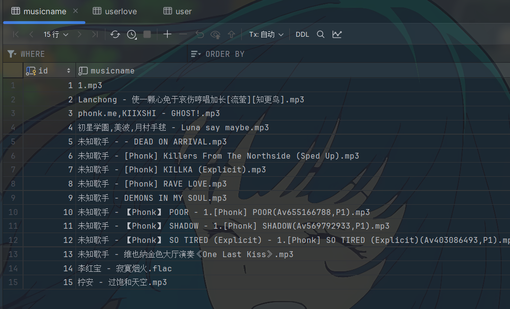
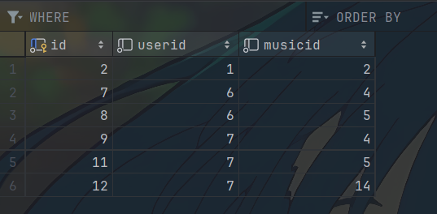
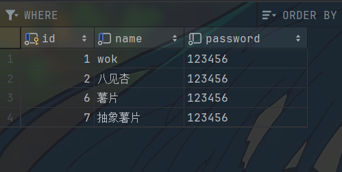
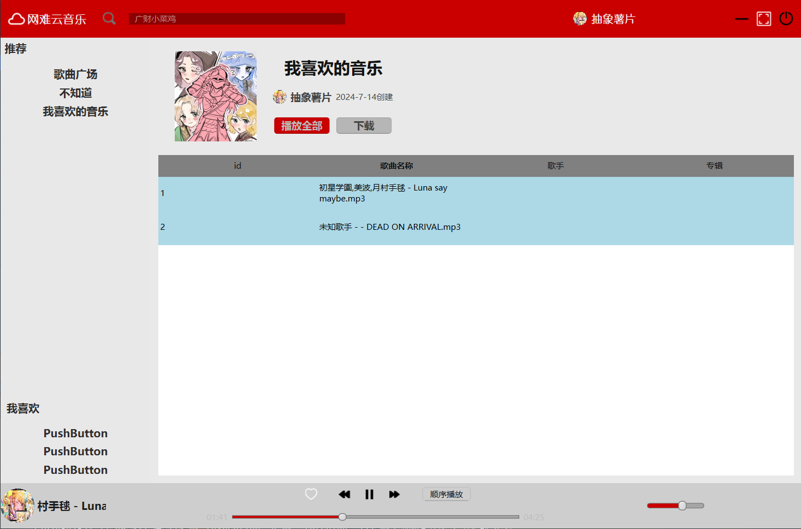

# 大概界面
这是一个很无聊的赛博垃圾

大概界面长这样

# 实现功能
1. 登录
2. 注册
3. 音乐播放
4. 声音调节
5. 我喜欢的音乐
# 数据表的格式
由于使用的是本地mysql，没有在网上购买服务器来存(没钱)，所以连接的sql因人而异

# 功能介绍
注册界面，是有圆边的，截图的后面黑色那是编辑器的颜色

主页面

我喜欢的音乐

播放模式只实现了随机播放和顺序播放，播放歌曲时歌曲名称会滚动(这个弄了我好久)

# 日后改进
推荐模式我写了py来个歌曲打标签，如果之后我不嫌麻烦的话可能会弄，其实本来是想用oss实现用户的头像这样的，但是懒的弄了，之后自己如果想改的话可以去加一个推荐模式，和用户头像

还有一些我个人的碎碎念就放这吧[广财小菜鸡的窝](https://violet2314.github.io/)
